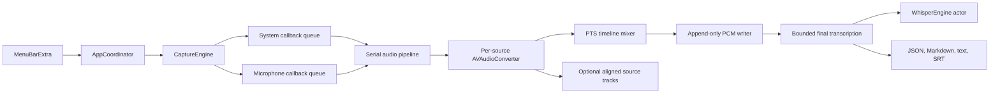

# Architecture

## Current data flow

Capture callbacks copy each `CMSampleBuffer` into an owned PCM buffer and
enqueue it on a dedicated serial processing queue. They do not access actors,
storage, SwiftUI, VAD, or Whisper. The processing queue converts each source to
16 kHz mono Float32, aligns it using presentation timestamps, and mixes it in
bounded chunks. The storage queue appends signed 16-bit little-endian samples.

The writer queue is independent from the Whisper actor. A missing model or an
inference error can fail transcription, but cannot stop or delete recording.

The coordinator checkpoints the complete frame count in the session manifest
every 10 seconds. It also checks disk space at the same interval. Recording is
refused below 1 GB free, warns below 3 GB free, and closes as an interrupted
session if available space falls below 1 GB while recording.

## Timeline behavior

Each source keeps a sorted, bounded timeline. Mixing advances only to the
watermark observed from both inputs. Missing ranges become silence. Converter
latency is drained at stop, and contiguous callbacks are placed against the
previous converted output frame so sample-rate converter latency does not add
gaps.

## Final transcription

The final service reads at most 28 seconds of PCM at a time with a 10 percent
overlap. The Whisper context is owned by one Swift actor. Overlap text is
deduplicated by bounded suffix and prefix token comparison. Transcript output is
written through temporary files followed by atomic replacement.

Whisper control tokens such as `<|nocaptions|>` are removed before transcript
segments are stored.

## Recovery and retry

At launch, the session repository scans local session directories. A manifest
left in `recording` is changed to `interrupted`, and its frame count is rebuilt
from the durable PCM file. An incomplete trailing Int16 byte is removed. A
manifest left in `finalizing` is also changed to `interrupted`. Captured,
interrupted, and failed sessions with usable audio can be transcribed again
from the menu. Retry recreates all transcript exports atomically from the mixed
PCM source.

Sleep, logout, ScreenCaptureKit failure, and critical disk space close the
audio pipeline and preserve the session as interrupted when the process has
time to handle the notification. The launch scanner remains the fallback when
the process is terminated before cleanup completes.

## History and settings

The repository is the source of truth for session history. There is no separate
index that can drift from the manifests. History supports opening, revealing,
renaming, exporting, deleting retained audio, deleting a session, and retrying
transcription. Renaming a completed session recreates the export files so the
Markdown title stays consistent.

Audio retention defaults to seven days and is applied only to completed
sessions. It never removes transcripts or audio needed for retry. Optional
system and microphone source tracks share the mixed recording timeline and are
covered by the same retention action.

Microphone, capture display, source gains, source-track retention, launch at
login, completion notification, and idle-sleep settings are persisted locally.

## Recorded deviations and deferred work

- The durable recorder, automatic final transcription, recovery, history,
  retention, export, login item, notification, source-track, and display
  selection work is implemented. CAF conversion and live draft transcription
  remain deferred.
- The initial capture registers only `.audio` and `.microphone`. The low-rate
  discarded screen-output compatibility mode is deferred until the manual
  audio-only test proves it is needed.
- Recording currently requires both permissions. The explicit
  system-audio-only confirmation flow for denied microphone access remains
  deferred.
- Final chunks use whisper.cpp VAD and bounded PCM reads. Launch recovery and
  idempotent retry are implemented, while incremental transcript checkpoints
  during final inference remain deferred.
- The upstream official XCFramework script emits several Apple platform slices.
  The Hae application target itself is restricted to arm64.
