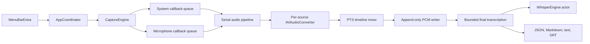

# Architecture

## Phase 0 data flow

Capture callbacks copy each `CMSampleBuffer` into an owned PCM buffer and
enqueue it on a dedicated serial processing queue. They do not access actors,
storage, SwiftUI, VAD, or Whisper. The processing queue converts each source to
16 kHz mono Float32, aligns it using presentation timestamps, and mixes it in
bounded chunks. The storage queue appends signed 16-bit little-endian samples.

The writer queue is independent from the Whisper actor. A missing model or an
inference error can fail transcription, but cannot stop or delete recording.

## Timeline behavior

Each source keeps a sorted, bounded timeline. Mixing advances only to the
watermark observed from both inputs. Missing ranges become silence. Converter
latency is drained at stop, and contiguous callbacks are placed against the
previous converted output frame so sample-rate converter latency does not add
gaps.

## Final transcription

The final service reads at most 28 seconds of PCM at a time with a 10 percent
overlap. The Whisper context is owned by one Swift actor. Overlap text is
deduplicated by bounded suffix and prefix token comparison. Transcript output is
written through temporary files followed by atomic replacement.

## Recorded deviations and deferred work

- This repository implements Phase 0 only. Recovery UI, history, retention,
  login items, notifications, CAF export, separate source retention, and live
  draft transcription remain deferred to their ordered phases.
- The initial capture registers only `.audio` and `.microphone`. The low-rate
  discarded screen-output compatibility mode is deferred until the manual
  audio-only test proves it is needed.
- Phase 0 requires both permissions. The later explicit system-audio-only flow
  for denied microphone access is not part of this spike.
- Final chunks use whisper.cpp VAD and bounded PCM reads. Full restart recovery
  and idempotent retry UI remain deferred, while all failed audio is preserved.
- The upstream official XCFramework script emits several Apple platform slices.
  The Hae application target itself is restricted to arm64.
